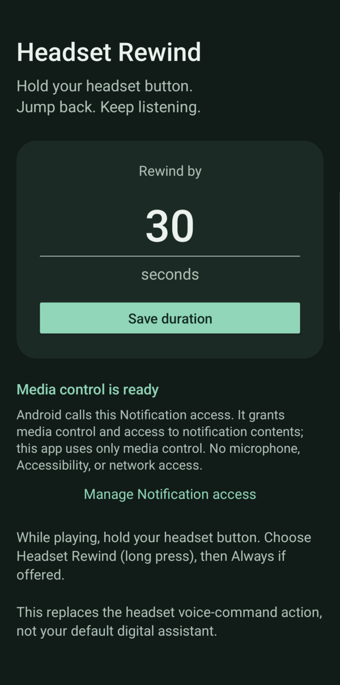

# Headset Rewind

One function: hold your headset's voice-command button to rewind the active
media session. Default **30 seconds**, adjustable from **1 to 120 seconds**.
Native Android/Java, light and dark themes, and no runtime dependencies.

## Download

Download the signed `headset-rewind-2.0.apk` from this repository's **Releases**
page once a release has been published. No Google Play account or developer fee
is required. Android may ask you to allow installation from your browser.

The public release uses a dedicated signing key. If the earlier debug APK is
installed, uninstall it before installing the release APK; Android cannot update
an app signed with a different key. Uninstalling resets its settings, Notification
access, and chosen voice-command handler. Later release updates can install over
this release when signed with the same key.

<p align="center">
  
</p>

Screenshot from a Samsung S25 Ultra. System bars were cropped for privacy.

## Setup

Requires Android 9+ and a headset whose long press launches Android's
voice-command chooser. Confirmed with a Shokz OpenSwim Pro and Samsung S25 Ultra.

1. Open Headset Rewind and grant **Notification access**.
2. Choose a rewind duration and tap **Save duration**.
3. Start a YouTube video or another seekable player.
4. Hold the headset button, select **Headset Rewind (long press)**, and choose
   **Always** if offered.

For sideloaded APKs on Android 13+, Android may block Notification access until
you open system **App info**, use the three-dot menu, and choose **Allow
restricted settings**. The exact wording/location varies by device.

There is no enable switch. The handler immediately sends the seek and closes;
it does not start a competing media session or open a microphone.
To change the headset action later, clear this app's defaults in system App info
or uninstall it. If another app already handles voice commands by default,
clear that app's defaults first.

## Troubleshooting

- **Holding the button opens another app:** clear that app's voice-command
  defaults, then hold the headset button and choose Headset Rewind.
- **No chooser opens:** this route requires `ACTION_VOICE_COMMAND`. Some headsets
  or phones launch a different assistant action; the app does not intercept it.
- **Nothing rewinds:** check Notification access, start a seekable video, and
  check the message at the bottom of the settings screen. Calls/communication
  audio suspend seeking.
- **Next/previous still skip tracks:** expected. Single/double/triple clicks are
  not remapped; only the long-press voice-command action is handled.

## Permission and privacy

**Notification access is required** to enumerate and control active media
sessions. Android also grants access to notification contents with this
permission, but this app never inspects or stores notifications.

**Accessibility/button detection is not needed and has been removed**, along
with multi-click detection, key diagnostics, and manual test controls.
No network permission, microphone access, ads, analytics, foreground service,
screen scraping, or default-assistant replacement.

Upgrading from the earlier prototype removes the old settings/diagnostic history
and turns the former 10-second value into 30 seconds. Other saved durations are
retained. Open the app once after upgrading to migrate the old handler switch.
The Notification access grant and chosen headset handler use the same components.

## Behavior and limitations

- Handles `ACTION_VOICE_COMMAND`, not `ACTION_ASSIST`. Any voice-command request
  routed to this handler rewinds, not only headset requests.
- Prefers a playing seekable session, then a paused one, in system-priority order.
  It does not redirect a seek if the selected session disappears.
- Uses the reported position, playback speed, elapsed time, and duration;
  clamps the destination at zero. Does not toggle playback or skip tracks.
- Calls/communication audio suspend seeking. Lock-screen/screen-off delivery
  depends on the headset and Android; the app does not bypass the keyguard.
- YouTube must publish a seekable session. Ads, live streams, app versions,
  and background-play restrictions can prevent seeking. A sent command is
  not proof the player honored it.

## Build

JDK 17 or 21, Android SDK platform 34, build tools 35.0.0.
Set `ANDROID_HOME` or an untracked `local.properties` with `sdk.dir`.

```sh
./gradlew :app:testDebugUnitTest :app:lintDebug :app:assembleDebug
./gradlew :app:assembleRelease
```

On Windows, use `gradlew.bat` instead of `./gradlew`.
For local installation, use `adb install -r app/build/outputs/apk/debug/app-debug.apk`.

Debug APK: `app/build/outputs/apk/debug/app-debug.apk`.
Release APK: `app/build/outputs/apk/release/app-release-unsigned.apk`.
Release builds are minified/resource-shrunk; keep signing secrets outside
the source tree. Target SDK 34 is a sideloadable baseline; review current
store requirements before publishing.

### Sign a release

`zipalign` and `apksigner` are included in Android SDK build tools 35.0.0.
Add that directory to your `PATH`, build the release, and sign it with your
private release key:

```sh
./gradlew :app:assembleRelease
zipalign -f 4 app/build/outputs/apk/release/app-release-unsigned.apk \
  app/build/outputs/apk/release/app-release-aligned.apk
apksigner sign --ks /path/to/release.p12 --v4-signing-enabled false \
  --out app/build/outputs/apk/release/headset-rewind-2.0.apk \
  app/build/outputs/apk/release/app-release-aligned.apk
apksigner verify --verbose app/build/outputs/apk/release/headset-rewind-2.0.apk
```

The signer prompts for the keystore password. Never commit or upload the private
key or its password. Keep a secure backup; losing the key prevents compatible
updates to installed releases. Public release assets should contain only the
signed APK and, optionally, its SHA-256 checksum.

### Publish on GitHub

After uploading the source to a public repository:

1. Open **Releases** and choose **Draft a new release**.
2. Create tag **v2.0** on the source commit used for this APK.
3. Set the title to **Headset Rewind 2.0**.
4. Attach `headset-rewind-2.0.apk` and `headset-rewind-2.0.apk.sha256`.
5. Explain the Notification access requirement and debug-to-release reinstall
   caveat in the release notes, then choose **Publish release**.

The APK will appear under **Assets** as a public download. Do not upload the
unsigned APK or put binaries in the source tree.

Unit tests cover seek arithmetic, the 30-second amount, playback speed,
paused playback, unknown timestamps/duration, and start/end clamping.
On-device checks: saved duration, long press during playing/paused media,
near-zero seeking, locked-screen behavior, and revoking Notification access.

## License

Copyright 2026 Headset Rewind contributors.
Licensed under the [Apache License 2.0](LICENSE).
Keep contributions focused on long-press backward seeking.
